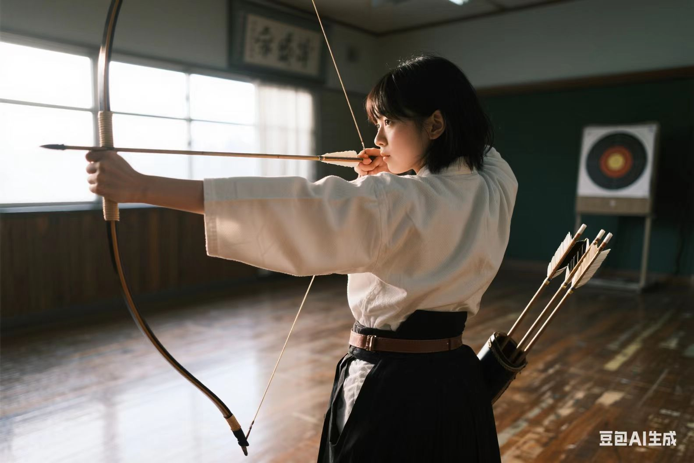

 

# 人像篇

## 室内JK自拍

> 帮我生成一张图片:图片风格为「真实人像摄影」，请你画一张及其平凡无奇的iPhone对镜自拍照，主角是穿着JK风格水手服的可爱女孩，佩戴着红色领结，在自己精心布置的可按风格的房间内的落地镜前用后置摄像头随手一拍的快照。照片开启了闪光灯，略带点快门速度不够导致的运动模糊，构图混乱，整体呈现出一种平庸和日常感，比例「9:16」。

## 弓道部少女

> 帮我生成一张图片:图片风格为「真实人像摄影」，请画一张展现弓道部少女瞄准靶心瞬间的照片。画面里，身着传统白色弓道服、黑色袴的少女跨立，左手稳稳托住长弓，右手拉弦至耳畔，眼神专注凝视远处，额前碎发微微垂下。弓道服的褶皱因动作自然堆叠，腰间的革带随动作绷紧。箭袋里放着着几支箭矢，木地板上还留有常年练习磨出的细微痕迹。照片视角从前侧方向微微仰拍，光线透过训练场的窗户洒在少女身上，形成明暗对比，拍摄者的角度看不到靶子，略带颗粒感的画面营造出纪实氛围，比例「3:2」。

