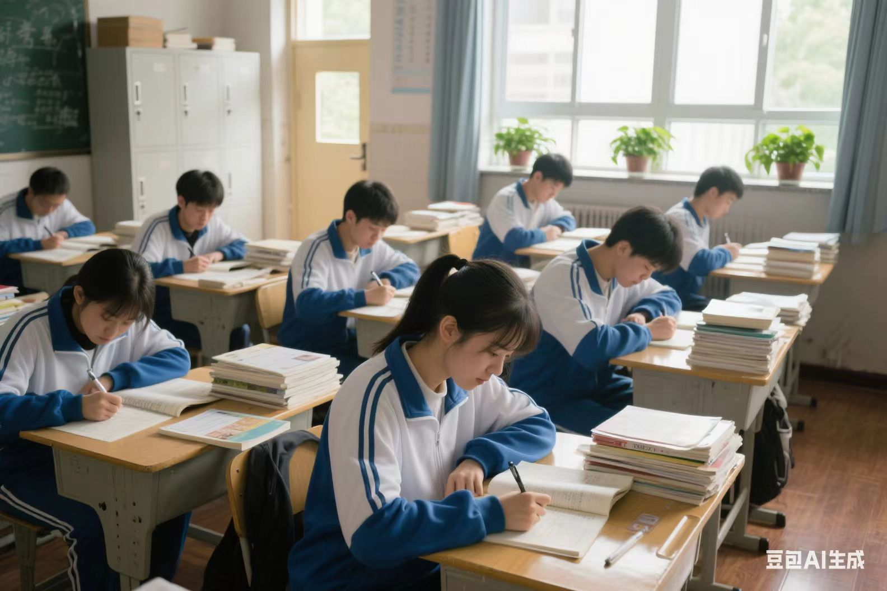

 

# 人像篇

## 0001-室内JK自拍

> 帮我生成一张图片:图片风格为「真实人像摄影」，请你画一张及其平凡无奇的iPhone对镜自拍照，主角是穿着JK风格水手服的可爱女孩，佩戴着红色领结，在自己精心布置的可按风格的房间内的落地镜前用后置摄像头随手一拍的快照。照片开启了闪光灯，略带点快门速度不够导致的运动模糊，构图混乱，整体呈现出一种平庸和日常感，比例「9:16」。

## 0002-弓道部少女

> 帮我生成一张图片:图片风格为「真实人像摄影」，请画一张展现弓道部少女瞄准靶心瞬间的照片。画面里，身着传统白色弓道服、黑色袴的少女跨立，左手稳稳托住长弓，右手拉弦至耳畔，眼神专注凝视远处，额前碎发微微垂下。弓道服的褶皱因动作自然堆叠，腰间的革带随动作绷紧。箭袋里放着着几支箭矢，木地板上还留有常年练习磨出的细微痕迹。照片视角从前侧方向微微仰拍，光线透过训练场的窗户洒在少女身上，形成明暗对比，拍摄者的角度看不到靶子，略带颗粒感的画面营造出纪实氛围，比例「3:2」。

## 0003-自习课

> 帮我生成一张图片：图片风格为「纪实校园摄影」，请展现一间教室安静自习课的场景。画面里，教室里座无虚席，高考前，各个课桌上都堆叠了大量的课本与习题册，没有灯，身着蓝白相间校服的学生们伏案低头，或执笔书写，或凝神思考。前排女生扎着低马尾，发梢随着低头的动作垂落肩头。后排靠窗男生支着下巴，目光专注地盯着面前翻开的笔记本。教室后排储物柜上摆放着几盆绿萝，叶片在微风中轻轻摇曳。窗外透过的阳光照在木质的地板上。照片视角从教室后门处平视拍摄，营造出静谧的氛围，画面带有轻微噪点增添真实感，比例「3:2」。

