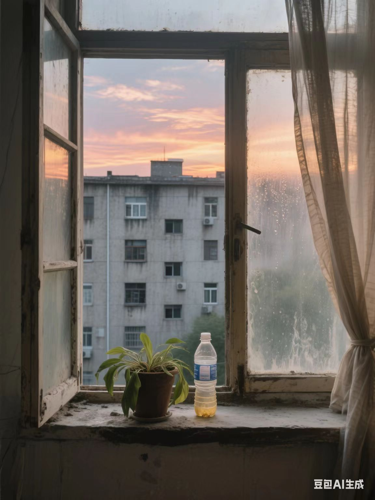

# 风景篇

> 帮我生成一张图片:图片风格为「真实风景摄影」，请画一张极其普通的窗台风景照。画面里，美丽的晚霞，对面陈旧居民楼的水泥墙面占据大半视野，屋内褪色的窗帘被风吹得微微晃动。窗台上随意摆着个积灰的盆栽，叶片蔫软，旁边是没有标签的泛黄陈旧的空矿泉水瓶，窗户打开着一扇。镜头透过有些污渍的玻璃窗拍摄，玻璃上还残留着几道雨水风干后的水痕，整体色调平淡唯美，画面歪斜，充满了平淡又琐碎的日常气息，比例「3:4」。

