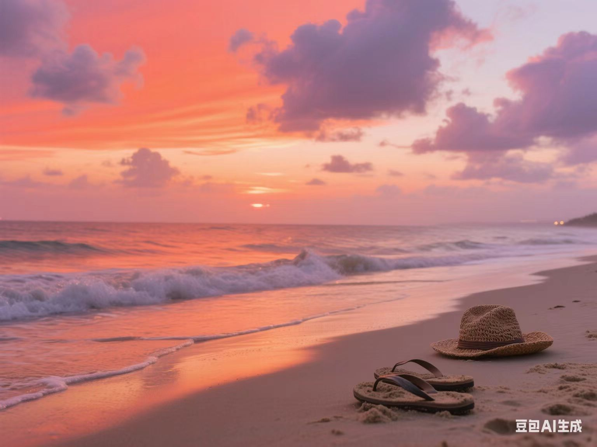
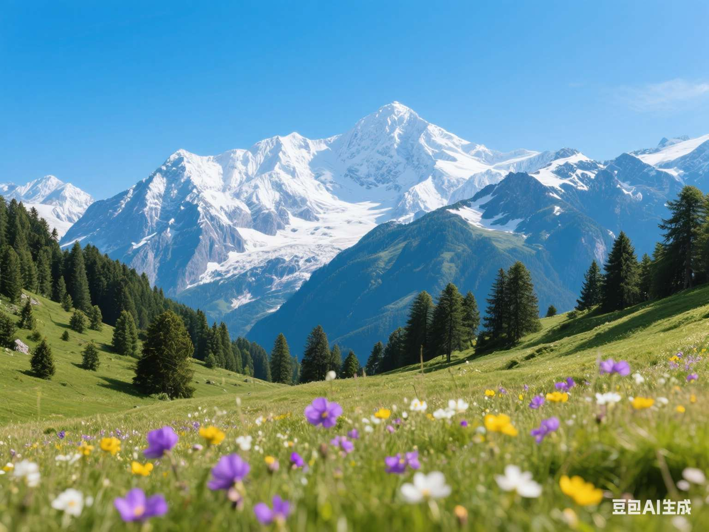

# 风景篇

## 0001-陈旧的窗台

> 帮我生成一张图片:图片风格为「真实风景摄影」，请画一张极其普通的窗台风景照。画面里，美丽的晚霞，对面陈旧居民楼的水泥墙面占据大半视野，屋内褪色的窗帘被风吹得微微晃动。窗台上随意摆着个积灰的盆栽，叶片蔫软，旁边是没有标签的泛黄陈旧的空矿泉水瓶，窗户打开着一扇。镜头透过有些污渍的玻璃窗拍摄，玻璃上还残留着几道雨水风干后的水痕，整体色调平淡唯美，画面歪斜，充满了平淡又琐碎的日常气息，比例「3:4」。

## 0002-海滩夕阳

> 帮我生成一张图片:图片风格为「真实风景摄影」，请画一张展现晚霞与沙滩夏日静谧氛围的照片。画面中，橙红色的晚霞铺满半边天空，云层被染成深浅不一的粉紫色，柔和的光线洒在细腻的沙滩上。海浪轻轻漫过沙滩，留下湿润的痕迹，远处海天相接处泛着微光。沙滩上远处随意扔着一顶褪色的草帽、一双沾满沙子的旧拖鞋。镜头视角微微倾斜，仿佛是游客随意举起手机拍摄，整体色调温暖朦胧，带着夏日傍晚独有的慵懒与宁静，比例「4:3」。

## 0003-晴天雪山

> 帮我生成一张图片:图片风格为「超高清风景摄影」，展现晴朗天气下的阿尔卑斯山脉壮丽景象。画面中，巍峨连绵的雪峰在蓝天的映衬下闪耀着圣洁的光芒，山顶覆盖着厚厚的积雪，在阳光下泛着晶莹的光泽。山腰处郁郁葱葱的松柏零零星星点缀其间，形成鲜明的色彩对比。前景是高山草甸，零零星星有紫色、黄色、白色的小花朵竞相绽放，随风轻轻摇曳。视角采用平视角度，光线明亮柔和，整个画面色彩鲜艳饱满，细节丰富，比例「4:3」。

